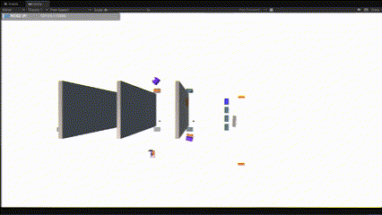
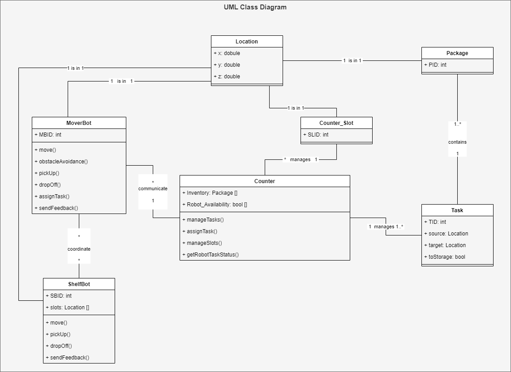
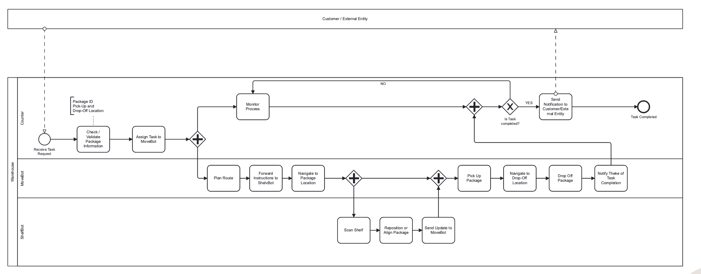
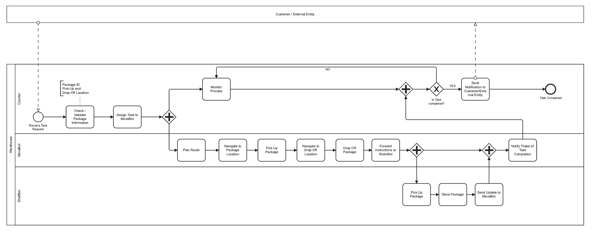

# Autonomous and Collaborative Robotics 2025: Warehouse Simulation



# Introduction

This repository is created as a project developed for a module at the University of Camerino. It contains the custom made Unity Project including 3D Models, Code, and ROS2 Integration. Furthermore, the project extends on the already existing ROS TCP Endpoint developed by the Unity Robotics Hub (https://github.com/Unity-Technologies/Unity-Robotics-Hub). 

# Installation

Due to the complexity of the virtual environment that must be established, we provide an extensive plan on how the software can be installed and started.

## Prerequirements

### 1. Unity Hub and Explorer (version: 6000.0.29f1)
Install the Unity Hub and make sure to download the Unity Explorer. Our project runs on the following version of the Unity Explorer: 6000.0.29f1. There may occur errors, if there is a mismatch of versions.

### 2. Docker Engine 
We work with a containerized version of ROS2 to make the installation as simple as possible. Please make sure that docker is running on your system. The project was developed on the following docker engine version: v27.4.0.

### 3. ROS TCP Endpoint
Unity provides a solution for integrating ROS within the Unity ecosystem. We have used the approach provided by [Unity Robotics Hub](https://github.com/Unity-Technologies/Unity-Robotics-Hub). Please make sure to clone their [repository](https://github.com/Unity-Technologies/Unity-Robotics-Hub) onto your machine and follow the tutorial from this [link](https://github.com/Unity-Technologies/Unity-Robotics-Hub/tree/main/tutorials/ros_unity_integration). Make sure to use the ROS2 guideline from the [tutorial](https://github.com/Unity-Technologies/Unity-Robotics-Hub/blob/main/tutorials/ros_unity_integration/setup.md). You do not have to generate the mesages yet in Unity, but can do it for testing that it works as expected.

## Installation guide

Our project extends the ROS TCP Endpoint by adding some msg/srv classes and adjusting the CMakeLists.txt file. Furthermore, the Sample Scene from the provided Unity Project is the starting point of the simulation.

- The directory **ROS2ACR** contains the Unity Project.
- The directory **CustomROSEndpoint** holds the configuration files to adjust the ROS TCP Enpoints container.

### 1. Build and start the docker container
Make sure to be in the correct directory when building the docker image from the Dockerfile. It is located in a Unity Robotics Hub subdirectory. 

```bash
docker build -t foxy -f ros2_docker/Dockerfile .
docker run -it --rm -p 10000:10000 foxy /bin/bash
```

### 2. Copy files from repo into running docker container
To simplify this process, we have created a Powershell script that automatically copies all relevant files into the correct docker container. Please navigate to this repository into the /CustomROSEndpoint and run the ./copy_files.ps1 script. 

In case the execution of scripts is disabled, run the following command in the powershell console:
```powershell
Set-ExecutionPolicy Bypass -Scope Process
.\copy_files.ps1
```

You can verify if the files have been copied successfully by navigating to the following location inside the running docker container: root@CONTAINER_ID:/home/dev_ws/src/unity_robotics_demo_msgs/msg. The following files should be present here:

- PosRot.msg (native)
- UnityColor.msg (native)
- MovePackage.msg (new)
- OpenTasks.msg (new)
- PackageSpawn.msg (new)

Similarly, in the root@CONTAINER_ID:/home/dev_ws/src/unity_robotics_demo_msgs/srv directory, the following files should be present:

- ObjectPoseService.srv (native)
- PositionService.srv (native)
- MovePackageService.srv (new)
- PackageSpawnService.srv (new)
- SetRobotStatus.srv (new)

Once all files are copied, run the following commands to rebuild the colcon workspace. Make sure to invoke those commands in the /dev_ws directory. 

```bash
source install/setup.bash
colcon build --cmake-clean-cache
source install/setup.bash
```

You can retrieve the list of all interfaces from ROS2 to see if the new message and services types have been created using the following command:

```bash
ros2 interface list
```

If this runs successfully and the message and services types are there, you can start the TCP Endpoint using the following command:

```bash
ros2 run ros_tcp_endpoint default_server_endpoint --ros-args -p ROS_IP:=0.0.0.0
```

### 3. Prepare Unity

Open the Unity Project from disk and load it. A double click on the sample scene should load the full scene with all robots and warehouse assets. 

If there is no **Robotics** in the navigation options at the top of the Unity Editor, please make sure to install it following this [tutorial](https://github.com/Unity-Technologies/Unity-Robotics-Hub/blob/main/tutorials/quick_setup.md).

Then, make sure to select ROS2 and leave the rest as it is in the configuration. Use the CustomROSEndpoint directory as the folder for the unity messages and generate all message types. This enables Unity to have the correct types and automatically generates the associated classes for it.

### 4. Start the simulation

You can now start the simulation with the play button at the top of your screen. Make sure the ROS TCP Endpoint is running. 

# Actions

There are several services that you can target using the ROS functions. The full processes of package-to-storage and storage-to-front are integrated within the spawn_package service.

For sending commands, open a new console window and connect to the running docker container. Retrieve the docker id with the following command:

```bash
docker container list
docker exec -it CONTAINER_ID bin/bash
source /opt/ros/foxy/setup.bash

ros2 service call /spawn_package unity_robotics_demo_msgs/srv/PackageSpawnService "{input: {package_id: 0, spawn_location: 0, target_location: 9, to_storage: true}}"
```

This spawns a new package in the simulation and the counter bot automatically handles the communication with the moverbot to start the collection and storage process.

The inputs can be manipulated. The to_storage variable indicates which process shall be used. If it is set to true, the counter will spawn a package at the given spawn_location and request the moverbot to store it at the target_location. The target location is mapped on the shelfs, where each shelf has 10 slots 0-9, 10-19, etc. If the to_storage variable is set to false, the counter sends a request to collect the package at the shelfs given the input location. 

At the moment, there are three different MoverBots that can run independently. However, the counter does not yet handle tasks when no moverbot is available. There could be the improvement to add a queue of open tasks and allocate this to the next robot that becomes available, but that exeeded the time and scope of this project.

# Project Architecture

## ROS 2 Architecture


## Sequence Diagram


## Class Diagram (abstracted)


## BPMN: Drop-Off


## BPMN: Pick-Up


# Support

If questions arise or you need help with the installation, please do not hesitate to reach out to us.

samuel.hilty@students.fhnw.ch
arbnor.bekiri@students.fhnw.ch
lukas.jakober@students.fhnw.ch